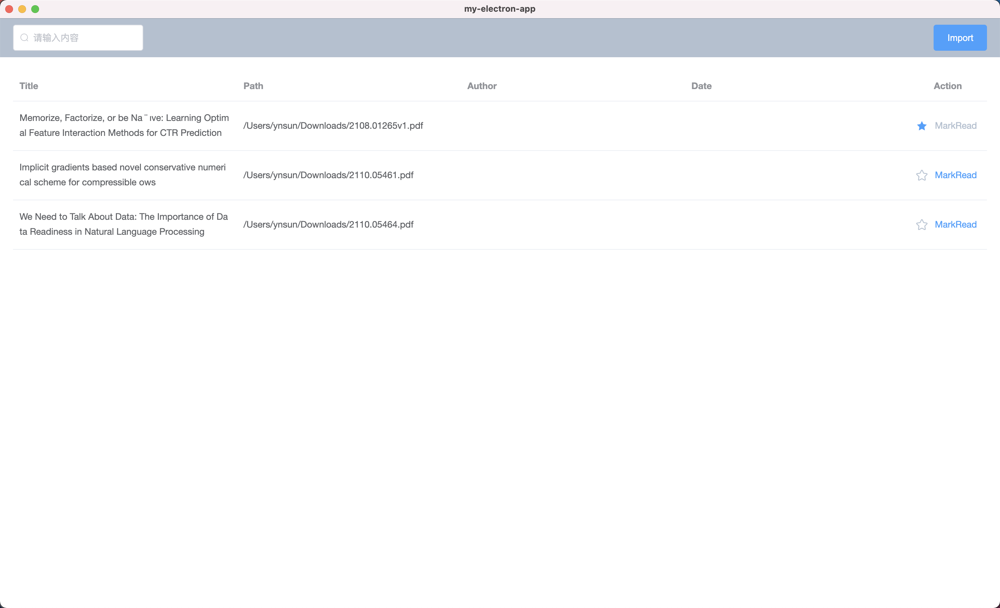

# paper-dictionary

Paper dictionary is an Electron based App for paper collection.
Users can use it to list paper in pdf type and support multiple operations including read, like, search and so on.




## Project setup

```
yarn install
```

### Compiles and hot-reloads for development

```
yarn serve
```

### Compiles and minifies for production

```
yarn build
```

### Lints and fixes files

```
yarn lint
```

### Customize configuration

See [Configuration Reference](https://cli.vuejs.org/config/).
